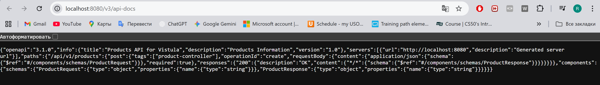
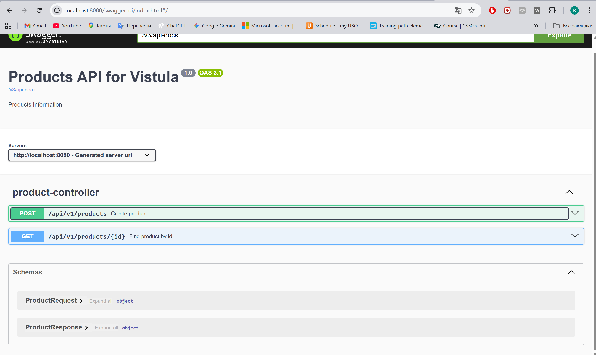
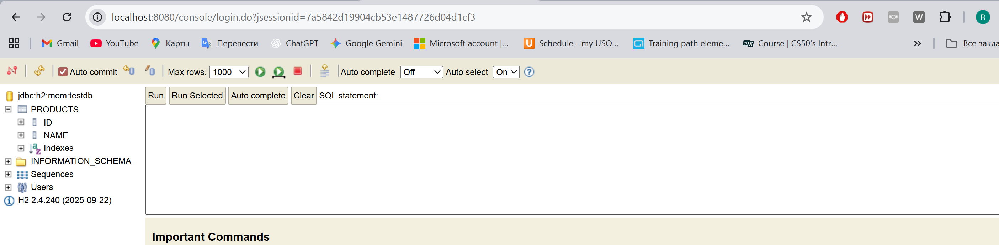

Answer for the question: This happened because of the switch to Spring Data JPA. ProductRepository now extends JpaRepository, which already provides ready-made methods such as save, findById, findAll, and deleteById. Spring automatically generates the implementation of this interface at application startup, so there is no need to write a custom one
The methods used in ProductService exactly match those in JpaRepository, so no compilation errors occur. When the repository was changed, Spring simply replaced the old implementation: previously data was stored in a HashMap, now it is saved to the database using automatically generated SQL queries
Errors would only appear if the service used methods that do not exist in JpaRepository

